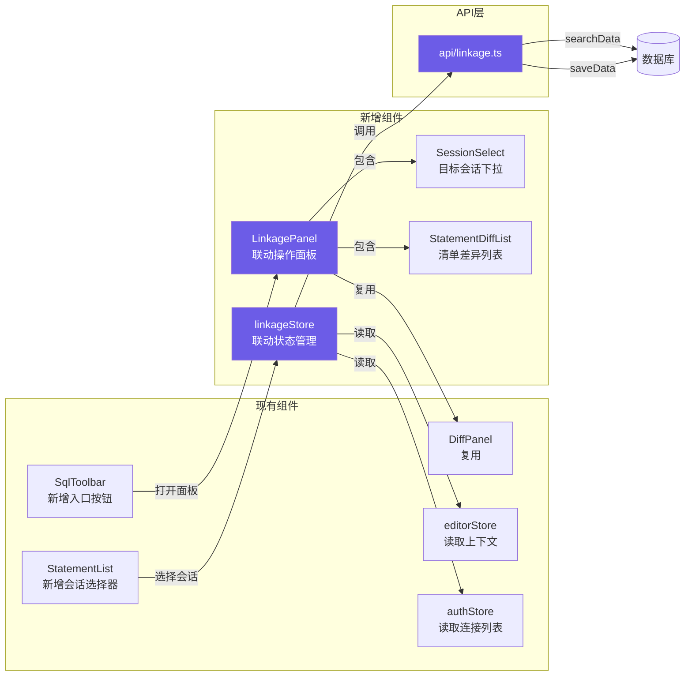

# 登录账户和其它账户联动功能 — 开发方案

> **文档状态**: 草案（待评审）
> **编写日期**: 2026-07-02
> **对应需求**: `登录账户和其它账户联动功能需求.txt`
> **相关技术栈**: `@nameson/sqlutils` v1.0.0-alpha.5 / Vue 3 + Pinia + Monaco Editor

---

## 目录

1. [需求澄清与术语表](#1-需求澄清与术语表)
2. [架构选型分析](#2-架构选型分析)
3. [核心流程设计](#3-核心流程设计)
4. [数据模型变更](#4-数据模型变更)
5. [风险与待确认清单](#5-风险与待确认清单)

---

## 1. 需求澄清与术语表

### 1.1 术语定义

| 术语 | 定义 | 说明 |
|------|------|------|
| **主会话 (MainSession)** | 当前用户登录并正在编辑的连接/账户 | 即 `auth store` 中的 `currentName`，用户在此会话中查看/编辑语句 |
| **目标会话 (TargetSession)** | 用户从已保存的多个连接中选择的另一个连接 | 作为对比参照的来源会话 |
| **同语句对比 (Single-Statement Diff)** | 基于 `OBJECTID + TABSEQ` 在主会话和目标会话中定位同一条语句，对比 `DBQUERY` 内容差异 | 类似当前 `DiffPanel.vue`，但对比的是两个不同会话的同一条语句 |
| **清单对比 (List Diff)** | 将当前页面的语句清单与目标会话中同一页面的语句清单进行对比，识别差异 | 核心输出：主会话缺少的语句列表 |
| **语句同步 (Statement Sync)** | 将目标会话中主会话缺少的语句复制（INSERT）到主会话的 `PRJOBJDS` 表中 | 仅单向同步：目标会话 → 主会话 |
| **严格模式 (Strict Mode)** | 当通过 OBJECTID+TABSEQ 在任一会话中查到 >1 条记录时，视为数据异常，抛出明确错误而非静默处理 | 防止数据不一致扩散 |

### 1.2 需求歧义点澄清

以下为我对需求文档中模糊之处的**推断和假设**。如有不符，请指出修正。

| # | 歧义点 | 我的理解/假设 | 待确认 |
|---|--------|--------------|--------|
| 1 | **主会话的定义** | 当前用户登录的会话（`auth.currentName`）。用户一次只能操作一个主会话 | [TBD] |
| 2 | **目标会话的选择** | 在语句清单或工具栏中新增下拉选择器，列出所有已保存的其他连接（排除当前），用户选择后触发对比 | [TBD] |
| 3 | **清单对比的匹配依据** | 以 `DSNAME`（语句名称）作为匹配依据。名称相同视为同一条语句，名称在目标会话中存在但在主会话中不存在视为"缺失语句" | [TBD] 是否应该用 DBQUERY 内容 hash 作为辅助匹配？ |
| 4 | **同步方向** | 仅单向：目标会话 → 主会话。不支持从主会话向目标会话推送 | [TBD] |
| 5 | **内容冲突处理** | 当同一 DSNAME 在两个会话中都存在但内容不同时，属于"差异语句"而非"缺失语句"，**不同步**，仅在清单中标记差异。需用户手动操作 | [TBD] |
| 6 | **DSSTMSEQ / DSSTMTY 生成规则** | 需求中说明 `DSSTMSEQ = DSSTMTY = TABSEQ = MAX(TABSEQ)+1`。推断：DSSTMSEQ 是语句序号，DSSTMTY 是语句类型（始终与 TABSEQ 同值） | [TBD] |
| 7 | **页面匹配逻辑** | 目标会话的对应页面通过 `PRJOBJECT.ENAME` + `PRJOBJECT.DSNAME` 联合定位：`OBJECTID = (SELECT OBJECTID FROM PRJOBJECT WHERE ENAME = 当前页面ENAME AND DSNAME = 当前语句DSNAME)` | 已在需求中明确 |
| 8 | **同步时新增字段填充** | 新增语句时，除 `DBQUERY`、`DSNAME`、`SORTBYCONTENT` 从源语句复制外，其余字段（`REF1/2/3`、`TABTY`、`TABNAME`、`PK_COLNAMES`、`ADDUSER/ADDDTTM`）均使用主会话当前用户和时间 | [TBD] 是否需要保留源语句的 `ADDUSER`/`ADDDTTM`？ |

### 1.3 核心业务规则总结

```
规则 1: 同语句查询
  SELECT OBJECTID, TABSEQ, DBQUERY, SORTBYCONTENT, ADDUSER, ADDDTTM, UPDUSER, UPDDTTM
  FROM PRJOBJDS
  WHERE OBJECTID = 主会话OBJECTID AND TABSEQ = 主会话TABSEQ

规则 2: 目标会话语句查询（同语句）
  SELECT ... FROM PRJOBJDS
  WHERE OBJECTID = (
    SELECT OBJECTID FROM PRJOBJECT
    WHERE ENAME = 当前页面ENAME AND DSNAME = 当前语句DSNAME
  ) AND TABSEQ = 当前TABSEQ

规则 3: 清单查询（目标会话）
  SELECT OBJECTID, TABSEQ, DSNAME, DBQUERY, SORTBYCONTENT,
         ADDUSER, ADDDTTM, UPDUSER, UPDDTTM
  FROM PRJOBJDS
  WHERE OBJECTID = (
    SELECT OBJECTID FROM PRJOBJECT
    WHERE ENAME = 当前页面ENAME AND DSNAME = 当前语句DSNAME
  )
  ORDER BY TABSEQ

规则 4: 最大序号获取
  SELECT MAX(TABSEQ) + 1 AS TABSEQ
  FROM PRJOBJDS
  WHERE OBJECTID = 主会话OBJECTID

规则 5: 新增语句时赋值
  DSSTMSEQ = DSSTMTY = TABSEQ = MAX(TABSEQ)+1（三值相同）
```

---

## 2. 架构选型分析

### 2.1 三种方案对比

| 维度 | 方案 A: 独立模块 | 方案 B: 嵌入主界面 | 方案 C: 混合模式 ⭐ |
|------|-----------------|-------------------|-------------------|
| **实现方式** | 新建独立页面/路由（如 `/linkage`），完全独立的 Vue 组件树 | 在现有 `EditorView.vue` 和各组件中嵌入联动 UI | 新建独立的 Pinia store 和 composable，UI 以面板/弹窗形式嵌入主界面 |
| **耦合度** | **低** — 仅通过 Pinia store 读取认证信息 | **高** — 需修改 `StatementList.vue`、`SqlToolbar.vue`、`EditorView.vue` | **中** — store 独立，UI 通过插槽/弹窗注入 |
| **对现有功能影响** | 无影响 | 有回归风险（修改核心组件） | 影响可控，仅在工具栏/清单增加入口点 |
| **用户体验** | 需要页面跳转，操作割裂 | 无缝集成，操作流畅 | 无缝集成，操作流畅（弹窗/面板） |
| **测试难度** | 可独立测试 | 需联动测试 | store 可独立单测，UI 需集成测试 |
| **代码复用** | store 可能与现有 store 重复 | 复用现有 `StatementList` | store 专注联动逻辑，复用 `DiffPanel` 组件 |
| **扩展性** | 易于扩展为独立产品 | 与编辑器绑定，扩展受限 | 中等 — 联动逻辑独立，可接入多种场景 |
| **开发工作量** | ≈3 天（需新建页面布局） | ≈2 天（但回归测试成本高） | ≈2.5 天 |
| **奥卡姆剃刀评价** | 过度设计 — 一个对比功能做一个独立页面 | 侵入性强 — 让核心组件背负联动职责 | 恰到好处 — 逻辑独立，UI 就近展示 |

### 2.2 推荐方案：C — 混合模式

**理由**：

1. **第一性原理**：联动的本质是「跨会话数据查询 + 差异展示 + 可选同步」，这是一个纯粹的**数据操作问题**，不应与编辑器 UI 强耦合。
2. **单一职责**：Pinia store 处理数据逻辑，UI 组件仅负责展示和交互。这是 Vue 3 的最佳实践。
3. **现有资产复用**：项目已有 `DiffPanel.vue`（Monaco Diff Editor）作为对比展示组件，可直接复用。

### 2.3 推荐架构分层

```
┌─────────────────────────────────────────────────────────┐
│                    UI Layer (组件层)                       │
├─────────────────────────────────────────────────────────┤
│  SqlToolbar.vue          ← 新增"联动对比"按钮入口          │
│  StatementList.vue       ← 新增目标会话下拉选择器           │
│  LinkagePanel.vue (新)   ← 联动操作面板（弹窗/侧面板）       │
│    ├── SessionSelector   ← 目标会话选择                    │
│    ├── StatementDiffList ← 清单差异列表                    │
│    └── SingleDiffView    ← 复用 DiffPanel.vue             │
├─────────────────────────────────────────────────────────┤
│                Store Layer (状态层)                        │
├─────────────────────────────────────────────────────────┤
│  stores/linkage.ts (新)   ← 联动专用 store                 │
│    - targetSession        目标会话信息                     │
│    - targetStatements     目标会话语句清单                  │
│    - diffResult           差异分析结果                     │
│    - syncQueue            待同步队列                       │
│  stores/auth.ts (现有)    ← 读取已保存的多连接              │
│  stores/editor.ts (现有)  ← 读取当前页面/语句上下文          │
├─────────────────────────────────────────────────────────┤
│                API Layer (数据层)                          │
├─────────────────────────────────────────────────────────┤
│  api/linkage.ts (新)      ← 联动专用 API                   │
│    - fetchTargetStatement 查询目标会话的单条语句            │
│    - fetchTargetStatements 查询目标会话的语句清单           │
│    - getMaxTabseq         获取最大序号                     │
│    - syncStatement        同步单条语句                     │
│    - syncStatements       批量同步                         │
├─────────────────────────────────────────────────────────┤
│              @nameson/sqlutils (数据模型层)                 │
│    - generateWhere        构建 SQL WHERE 条件              │
│    - generateDataModel    构建 ColdataModel (INSERT)       │
│    - saveData             提交保存                         │
│    - searchData           查询数据                         │
└─────────────────────────────────────────────────────────┘
```

---

## 3. 核心流程设计

### 3.1 同语句对比流程

```mermaid
sequenceDiagram
    actor U as 用户
    participant SL as StatementList
    participant LinkS as linkageStore
    participant API as linkageApi
    participant DB as 数据库
    participant D as DiffPanel

    U->>SL: 选中一条语句 (TABSEQ=N)
    U->>SL: 选择目标会话
    SL->>LinkS: setTargetSession(session)
    U->>SL: 点击"跨会话对比"

    LinkS->>API: fetchTargetStatement(targetSession, ename, dsname, tabseq)
    API->>DB: SELECT FROM PRJOBJDS<br/>WHERE OBJECTID=(<br/>  SELECT OBJECTID FROM PRJOBJECT<br/>  WHERE ENAME=当前ENAME<br/>  AND DSNAME=当前DSNAME)<br/>AND TABSEQ=当前TABSEQ

    alt 查询结果 > 1 条
        DB-->>API: 返回多行
        API-->>LinkS: [严格模式] 错误: 目标会话数据异常
        LinkS-->>U: 弹窗提示: 目标会话该语句存在多条记录
    else 查询结果 = 1 条
        DB-->>API: 返回一条
        API-->>LinkS: 目标语句内容
        LinkS->>D: 打开 Diff 面板
        D-->>U: 左侧: 主会话语句 | 右侧: 目标会话语句
    else 查询结果 = 0 条
        DB-->>API: 空
        API-->>LinkS: 语句不存在
        LinkS-->>U: 提示: 目标会话中无此语句
    end
```

### 3.2 清单对比与同步流程

```mermaid
sequenceDiagram
    actor U as 用户
    participant SL as StatementList
    participant LinkS as linkageStore
    participant API as linkageApi
    participant DB as 数据库
    participant D as LinkagePanel
    participant SD as saveData

    U->>SL: 选择目标会话
    U->>SL: 点击"清单对比"

    LinkS->>API: fetchTargetStatements(targetSession, ename, dsname)
    API->>DB: SELECT TABSEQ,DSNAME,DBQUERY,SORTBYCONTENT,<br/>ADDUSER,ADDDTTM,UPDUSER,UPDDTTM<br/>FROM PRJOBJDS<br/>WHERE OBJECTID=(子查询)

    DB-->>API: 目标会话语句清单 (List A)

    LinkS->>LinkS: 获取主会话语句清单 (List B, 从 editor store)

    LinkS->>LinkS: 对比分析:<br/>① 主会话缺少 (A有B无) → missingList<br/>② 内容差异 (同名但内容不同) → diffList<br/>③ 目标会话缺少 (B有A无) → extraList (仅供参考)

    LinkS->>D: 展示差异结果
    D-->>U: 三栏展示: 缺失 / 差异 / 仅主会话有

    U->>D: 勾选需要同步的缺失语句
    U->>D: 点击"同步到主会话"

    D->>LinkS: syncSelectedStatements(selectedList)

    LinkS->>API: getMaxTabseq(mainSession, objectId)
    API->>DB: SELECT MAX(TABSEQ)+1 FROM PRJOBJDS<br/>WHERE OBJECTID=主会话OBJECTID

    alt 并发检测: 序号已被占用
        DB-->>API: (其他会话已插入)
        API-->>LinkS: 序号冲突
        LinkS->>LinkS: 重试: 重新获取 MAX(TABSEQ)+1
    end

    DB-->>API: nextSeq
    API-->>LinkS: nextSeq

    loop 每条待同步语句
        LinkS->>LinkS: 构建 ColdataModel (INSERT)<br/>• OBJECTID = 主会话OBJECTID<br/>• TABSEQ = DSSTMSEQ = DSSTMTY = nextSeq++<br/>• DBQUERY, DSNAME, SORTBYCONTENT 来自目标<br/>• ADDUSER/UPDUSER = 主会话用户
    end

    LinkS->>SD: saveData(postList)
    SD->>DB: POST /SaveDatas

    alt 保存成功
        DB-->>SD: { statusCode: '1' }
        SD-->>LinkS: 成功
        LinkS->>SL: 刷新语句清单
        LinkS-->>U: 同步完成 (N 条语句)
    else 保存失败
        DB-->>SD: { statusCode: '-1', message }
        SD-->>LinkS: 失败
        LinkS-->>U: 错误提示 + 建议重试
    end
```

### 3.3 数据写入流程（@nameson/sqlutils 模式）

```mermaid
flowchart TB
    subgraph Input["输入"]
        S["目标会话语句对象<br/>{ DSNAME, DBQUERY, SORTBYCONTENT }"]
        M["主会话上下文<br/>{ OBJECTID, username, sessionId }"]
    end

    subgraph Step1["Step 1: 获取序号"]
        Q1["SELECT MAX(TABSEQ) + 1<br/>FROM PRJOBJDS<br/>WHERE OBJECTID = #{objectId}"]
        Q1 --> NEXT["nextTabseq = 查询结果"]
    end

    subgraph Step2["Step 2: 构建 DataModel"]
        DM["generateDataModel({<br/>  tableName: 'PRJOBJDS',<br/>  user: username<br/>})"]
        DM2["setKeyTypeMap({ NUMBER: ['TABSEQ','DSSTMSEQ','DSSTMTY'] })"]
        DM3["setPKvalues({ OBJECTID, TABSEQ: nextTabseq })"]
        DM4["setColdatas(<br/>  { OBJECTID, TABSEQ, DSNAME, DBQUERY,<br/>    SORTBYCONTENT, DSSTMSEQ, DSSTMTY },<br/>  undefined  ← 新值为空则 ADD<br/>)"]
    end

    subgraph Step3["Step 3: 保存"]
        POST["saveData([dataModel.build()])"]
    end

    S --> Step1
    M --> Step1
    Step1 --> Step2
    Step2 --> Step3

    style Step2 fill:#1a1a2e,stroke:#6c5ce7
    style Input fill:#16213e,stroke:#0f3460
```



### 3.4 组件交互关系



---

## 4. 数据模型变更

### 4.1 涉及的表

#### PRJOBJECT — 无需变更

仅作为查询条件使用（通过 ENAME + DSNAME 定位 OBJECTID）。

#### PRJOBJDS — 无需 DDL 变更

该表已包含所有需要的字段。同步操作仅涉及 INSERT 新行。

#### 查询模式汇总

```sql
-- 同语句查询（主会话）
SELECT OBJECTID, TABSEQ, DBQUERY, SORTBYCONTENT,
       ADDUSER, ADDDTTM, UPDUSER, UPDDTTM
FROM PRJOBJDS
WHERE OBJECTID = :mainObjectId
  AND TABSEQ = :currentTabseq

-- 同语句查询（目标会话）
SELECT OBJECTID, TABSEQ, DBQUERY, SORTBYCONTENT,
       ADDUSER, ADDDTTM, UPDUSER, UPDDTTM
FROM PRJOBJDS
WHERE OBJECTID = (
    SELECT OBJECTID FROM PRJOBJECT
    WHERE ENAME = :currentEname
      AND DSNAME = :currentDsname
)
AND TABSEQ = :currentTabseq

-- 清单查询（目标会话）
SELECT OBJECTID, TABSEQ, DSNAME, DBQUERY, SORTBYCONTENT,
       ADDUSER, ADDDTTM, UPDUSER, UPDDTTM
FROM PRJOBJDS
WHERE OBJECTID = (
    SELECT OBJECTID FROM PRJOBJECT
    WHERE ENAME = :currentEname
      AND DSNAME = :currentDsname
)
ORDER BY TABSEQ

-- 最大序号查询（主会话）
SELECT NVL(MAX(TABSEQ), 0) + 1 AS NEXTSEQ
FROM PRJOBJDS
WHERE OBJECTID = :mainObjectId
```

### 4.2 新增 INSERT 操作的 ColdataModel 构建

基于 `@nameson/sqlutils` 的模式（模板 A：单条记录变更 — ADD 场景）：

```typescript
// 伪代码 — 仅逻辑示意，非实际代码
function buildSyncModel(
  sourceStatement: TargetStatementVO,  // 来自目标会话
  targetObjectId: number,              // 主会话 OBJECTID
  newTabseq: number,                   // MAX(TABSEQ) + 1
  currentUser: string                  // 主会话用户
): ColdataModel {
  const dm = generateDataModel({
    tableName: 'PRJOBJDS',
    user: currentUser,
  })

  // 声明数字类型字段（避免 NUMBER 主键被加引号）
  dm.setKeyTypeMap({
    NUMBER: ['TABSEQ', 'DSSTMSEQ', 'DSSTMTY'],
  })

  // 设置主键
  dm.setPKvalues({
    OBJECTID: targetObjectId,
    TABSEQ: newTabseq,
  })

  // 新数据（oldData=undefined → 自动识别为 ADD）
  // ADD 时自动填充 ADDUSER/ADDDTTM/UPDUSER/UPDDTTM
  dm.setColdatas(
    {
      OBJECTID: targetObjectId,
      TABSEQ: newTabseq,
      DSSTMSEQ: newTabseq,       // = TABSEQ
      DSSTMTY: newTabseq,        // = TABSEQ
      DSNAME: sourceStatement.DSNAME,
      DBQUERY: sourceStatement.DBQUERY,
      SORTBYCONTENT: sourceStatement.SORTBYCONTENT,
      // 以下字段使用源数据的值 [TBD: 是否需要切换?]
      REF1: sourceStatement.REF1,
      REF2: sourceStatement.REF2,
      REF3: sourceStatement.REF3,
      TABTY: sourceStatement.TABTY,
      TABNAME: sourceStatement.TABNAME,
      PK_COLNAMES: sourceStatement.PK_COLNAMES,
    },
    undefined  // oldData 为空 → INSERT
  )

  return dm.build()
}
```

### 4.3 并发安全分析

#### 问题：MAX(TABSEQ)+1 的并发风险

```
时间线：
  T1: 用户 A 查询 MAX(TABSEQ) = 10 → 新序号 11
  T2: 用户 B 查询 MAX(TABSEQ) = 10 → 新序号 11
  T3: 用户 A INSERT TABSEQ=11 → 成功
  T4: 用户 B INSERT TABSEQ=11 → 主键冲突!
```

#### 替代方案对比

| 方案 | 原理 | 优点 | 缺点 | 推荐 |
|------|------|------|------|------|
| **A: 乐观锁 + 重试** | INSERT 前再次检查 `MAX(TABSEQ)`，冲突时 `+1` 重试（最多 3 次） | 客户端可控，改动小 | 不能 100% 避免，重试仍有概率失败 | ⭐⭐ |
| **B: 服务端事务** | 请求服务端提供"获取序号+插入"的原子接口 | 完美避免冲突 | 需要后端配合，可能不可行 | ⭐⭐⭐⭐ |
| **C: 数据库 SEQUENCE** | 使用 Oracle SEQUENCE 代替 `MAX(TABSEQ)+1` | 数据库原生保证唯一 | 需要 DBA 创建 SEQUENCE；TABSEQ 语义可能不符合 | ⭐⭐⭐ |
| **D: 时间戳+随机数** | `TABSEQ = 时间戳后6位 + 2位随机数` | 无需查询 MAX | TABSEQ 失去连续序号语义，可能与现有逻辑冲突 | ⭐ |

**当前推荐**: 方案 A（乐观锁 + 重试）作为**前端实施**方案。如果后端可配合，优先使用方案 B。

```typescript
// 乐观锁重试伪代码
async function getNextTabseqWithRetry(
  objectId: number,
  maxRetries = 3
): Promise<number> {
  for (let i = 0; i < maxRetries; i++) {
    const next = await getMaxTabseq(objectId)
    // 尝试插入时如果失败（主键冲突），进入下一轮重试
    return next
  }
  throw new Error('获取序号失败：超过最大重试次数')
}
```

> **实际约束**: 由于 `SaveDatas` 接口是批量提交的，前端无法在插入过程中实时检测主键冲突。因此"重试"是指在 **saveData 失败后**重新获取序号+重新构建 ColdataModel + 重新 saveData。

---

## 5. 风险与待确认清单

### 5.1 高风险项（需立即决策）

| # | 风险/待确认项 | 影响范围 | 建议决策 |
|---|-------------|---------|---------|
| **R1** | **清单对比的匹配算法**: 以 DSNAME 为唯一匹配键是否足够？如果两个会话中同一条语句的 DSNAME 不同但内容相同怎么办？ | 对比结果准确性 | 建议方案：DSNAME 作为主匹配键 + DBQUERY 标准化 hash 作为辅助。若 DSNAME 不匹配但内容 hash 匹配，标记为"疑似同名"供用户判断 |
| **R2** | **同步时元数据归属**: 同步过来的语句，`ADDUSER`/`ADDDTTM` 应该填充「原始创建人」（从目标会话复制）还是「当前用户」（新创建）？ | 审计追溯 | 建议填充当前用户，因为从主会话角度看这是新创建的语句。在 DSNAME 中可追加 `[sync from xxx]` 标记来源 |
| **R3** | **并发写入冲突处理**: `MAX(TABSEQ)+1` 方案在并发场景下可能产生主键冲突 | 数据一致性 | 方案见 4.3 节。需确认后端是否可提供原子化接口 |
| **R4** | **OBJECTID 映射关系**: 需求中 `PRJOBJECT WHERE ENAME=当前ENAME AND DSNAME=当前DSNAME` 的子查询 — 如果当前语句的 DSNAME 为空怎么办？ | 查询失败 | 需确认 DSNAME 是否一定非空。如果可为空，降级为仅用 ENAME 匹配 |

### 5.2 中风险项（可在开发中确认）

| # | 风险/待确认项 | 影响范围 | 处理方式 |
|---|-------------|---------|---------|
| **R5** | **严格模式的触发条件**: 需求说">1 条时抛出明确错误"，但"=0 条"时如何处理？ | 用户体验 | 当前方案：0 条时提示"目标会话中无此语句"，不报错 |
| **R6** | **DSSTMSEQ/DSSTMTY 字段含义**: 需求说三个字段同值，但 DSSTMTY 的字面意思是"语句类型"，用一个不断递增的数字作为类型是否合理？ | 字段语义 | 按需求实现，标记为 [TBD] 等需求方澄清 |
| **R7** | **大量语句同步的性能**: 如果清单差异有数百条语句，一次性 saveData 是否可行？ | 性能 | 建议分批提交（每批 ≤ 50 条），显示进度条 |
| **R8** | **目标会话不可达**: 如果目标会话的服务器连接失败、超时或会话过期，如何降级？ | 用户体验 | 发起查询前先检测目标会话连接状态；失败时明确提示并建议用户先切换/重新登录目标会话 |

### 5.3 技术债务/已知限制

| # | 描述 | 后续计划 |
|---|------|---------|
| **T1** | 清单对比仅做客户端 diff（两个数组在内存中比较），不做数据库级 JOIN | 当前规模（每页面一般 < 100 条语句）足够。如果未来页面语句超过 1000 条，考虑后端 SQL 做差集 |
| **T2** | 同步是单向的（目标 → 主会话），不支持双向同步或冲突合并 | 一期不实现，观察用户反馈后再决定 |
| **T3** | 同步后需要手动刷新语句清单（已设计为自动刷新，但网络异常时可能失败） | 在 saveData 成功后自动调用 `editorStore.loadStatements()` |

### 5.4 需要用户决策的问题汇总

以下问题需要你逐一确认后才能进入详细设计：

1. **[匹配算法]** 清单对比以 DSNAME 为匹配键是否合理？是否需要 DBQUERY hash 作为辅助？
2. **[元数据归属]** 同步的新语句 ADDUSER 应该用当前用户还是原始创建人？
3. **[DSNAME 可空性]** DSNAME 字段是否可能为空？如果为空，如何定位目标会话中的对应语句？
4. **[DSSTMTY 语义]** `DSSTMTY = TABSEQ` 的规则是否正确理解？
5. **[UI 形态]** 联动面板是用「侧边抽屉」还是「居中弹窗」？建议侧边抽屉（类似现有 DraftDrawer），不遮挡编辑区。
6. **[后端接口]** 后端是否能提供原子化的"获取序号+插入"接口来彻底解决并发问题？
7. **[批量同步上限]** 单次同步语句数量是否需要上限？建议 ≤ 50 条/批。
8. **[REF1/2/3 等辅助字段]** 同步时这些字段从源复制还是留空？

---

## 附录 A: 与现有代码的集成点

### A.1 需要修改的现有文件

| 文件 | 修改内容 | 风险等级 |
|------|---------|---------|
| `src/components/SqlToolbar.vue` | 新增"联动对比"按钮入口 | 低 — 仅新增按钮 |
| `src/components/StatementList.vue` | 在顶部新增目标会话选择器；右键菜单新增"跨会话对比" | 中 — 涉及模板和逻辑变更 |
| `src/stores/editor.ts` | 无直接修改；linkageStore 通过 getter 读取 | 低 |
| `src/stores/auth.ts` | 可能新增 `getOtherAccounts()` getter（排除当前） | 低 |

### A.2 需要新建的文件

| 文件 | 职责 |
|------|------|
| `src/stores/linkage.ts` | 联动状态管理 |
| `src/api/linkage.ts` | 联动 API 封装 |
| `src/components/LinkagePanel.vue` | 联动操作面板（含 SessionSelector + StatementDiffList） |
| `src/components/linkage/` | [可选] 子组件目录（按需拆分） |

### A.3 复用的现有组件

| 组件 | 复用场景 |
|------|---------|
| `DiffPanel.vue` | 同语句跨会话对比展示（传入 originalSql/targetSql） |
| `DraftDrawer.vue` | 可作为 LinkagePanel 的 UI 参考（侧边抽屉模式） |

---

## 附录 B: 第 1.2 节歧义点速查

| # | 歧义点 | 快捷确认 |
|---|--------|---------|
| 1 | 主会话定义 | 当前登录的会话 ✓ |
| 2 | 目标会话选择 | 下拉选择器 |
| 3 | 匹配依据 | DSNAME |
| 4 | 同步方向 | 单向：目标 → 主 |
| 5 | 内容冲突 | 不同步，标记差异 |
| 6 | DSSTMSEQ/DSSTMTY | = TABSEQ |
| 7 | 页面匹配 | ENAME + DSNAME |
| 8 | 新增字段填充 | 当前用户 |

---

> **文档版本**: v0.1（草案）
> **下一步**: 请逐条确认 [5.4 需要用户决策的问题汇总] 中的 8 个问题，确认后我将展开详细设计（包含组件 API 定义、store 接口 TypeScript 类型定义等）。
