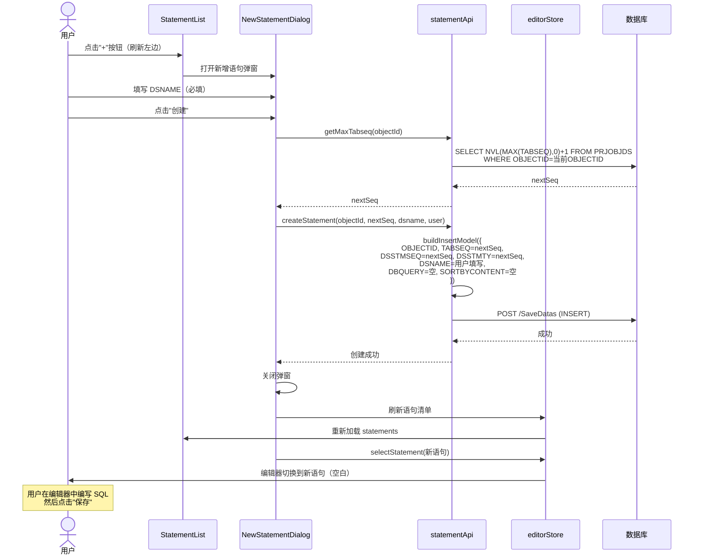
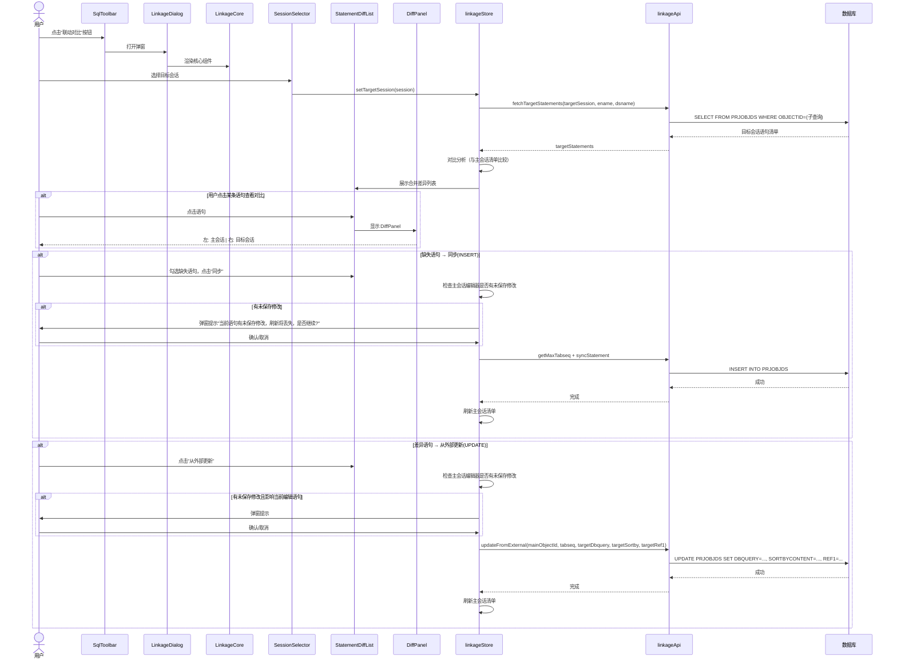
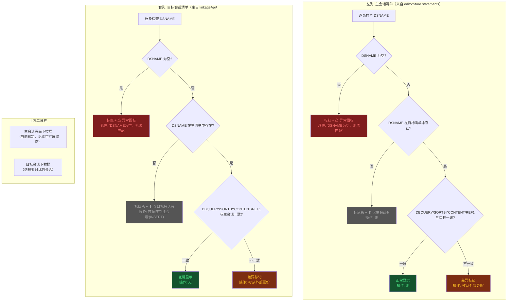
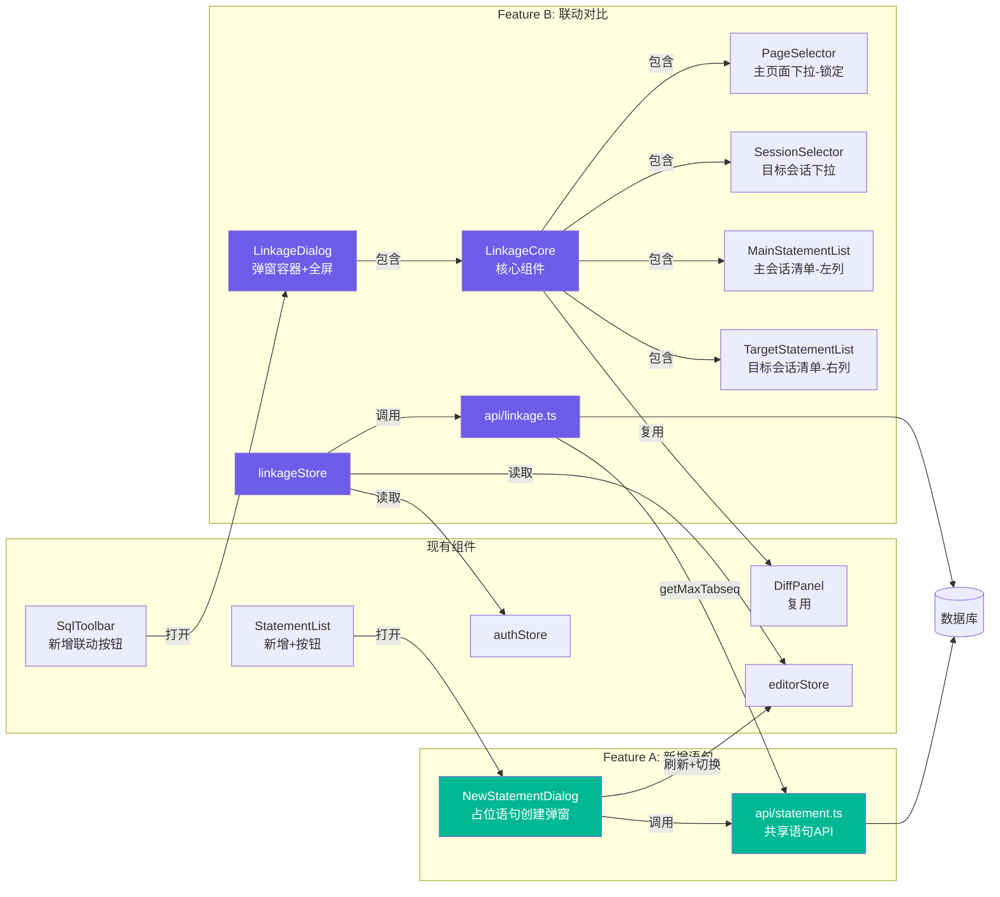
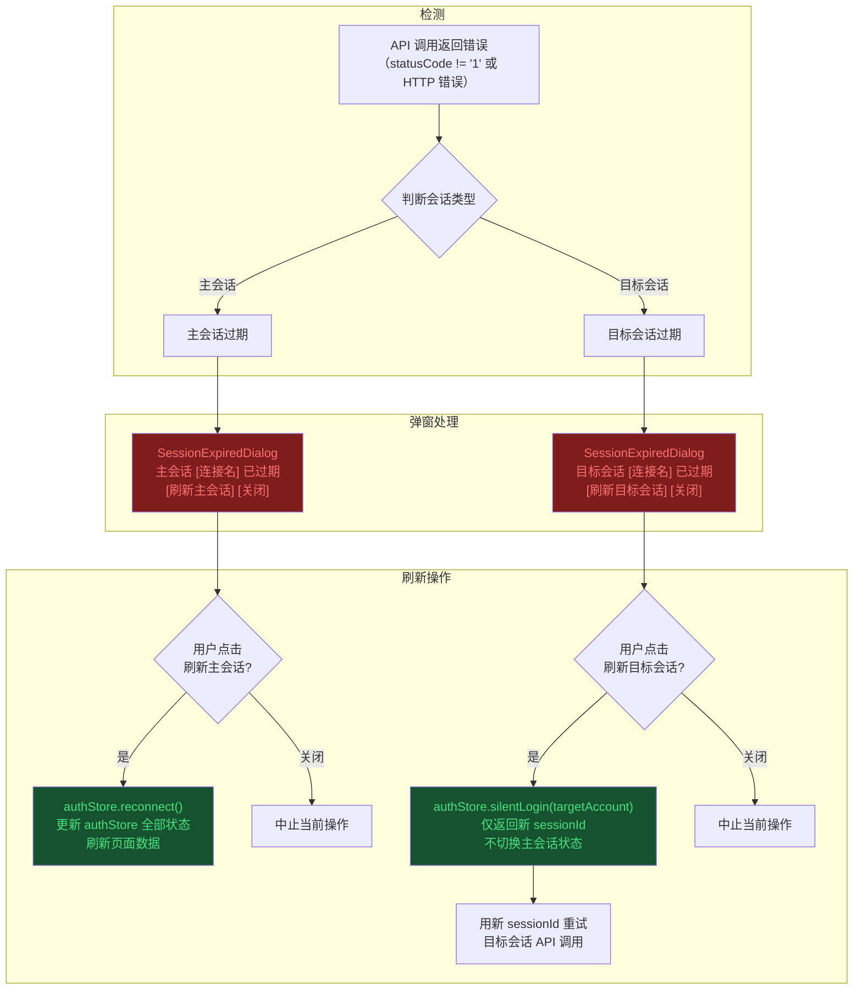

# 登录账户和其它账户联动功能 — 开发方案

> **文档状态**: v0.4（Q1–Q9 全部确认，清单对比改为左右双列表，UPDATE 增加 REF1）
> **编写日期**: 2026-07-02
> **对应需求**: `登录账户和其它账户联动功能需求.txt`
> **相关技术栈**: `@nameson/sqlutils` v1.0.0-alpha.5 / Vue 3 + Pinia + Monaco Editor

---

## 目录

1. [需求澄清与术语表](#1-需求澄清与术语表)
2. [架构选型分析](#2-架构选型分析)
3. [核心流程设计](#3-核心流程设计)
4. [数据模型变更](#4-数据模型变更)
5. [风险与待确认清单](#5-风险与待确认清单)

---

## 1. 需求澄清与术语表

### 1.1 功能全景

本方案包含两个功能模块，二者共享同一套 `MAX(TABSEQ)+1` INSERT 机制：

| 功能 | 说明 | 入口 |
|------|------|------|
| **Feature A: 新增语句** | 在语句清单中手动创建占位语句，用户填写基本信息后创建空壳，再在编辑器中编写 SQL 内容并保存 | 语句清单面板「新增」按钮 |
| **Feature B: 账户联动对比与同步** | 选择目标会话，对比两个会话的语句清单，支持缺失语句同步（INSERT）和差异语句更新（UPDATE） | 工具栏「联动对比」按钮 |

### 1.2 术语定义

| 术语 | 定义 | 说明 |
|------|------|------|
| **主会话 (MainSession)** | 当前用户登录的连接/账户 | 只有一个主登录。主界面的页面清单和语句清单**始终绑定主会话**，切换会话只能通过现有的「切换连接」功能 |
| **目标会话 (TargetSession)** | 用户在联动弹窗内选择的另一个已保存连接 | 选择操作**在弹窗内部完成**，主界面不涉及 |
| **新增语句 (Add Statement)** | 在主会话当前页面下创建一条新的 PRJOBJDS 记录 | 创建的是**占位语句**：用户填写 DSNAME 等基本信息，DBQUERY 留空，创建成功后自动切换到该语句由用户编写 |
| **同语句对比** | 基于 OBJECTID + TABSEQ 在两个会话中定位同一条语句，对比 DBQUERY 差异 | 复用 DiffPanel.vue |
| **清单对比** | 左右双列对照：左为主会话清单，右为目标会话清单。DSNAME 为空标红色异常，不在对方列表中标灰色 | 两边语句各自列出 |
| **语句同步 (INSERT)** | 将目标会话中主会话缺少的语句复制到主会话 | 单向：目标 → 主会话 |
| **从外部更新 (UPDATE)** | 差异语句（两边都有但内容不同），用目标会话内容覆盖主会话的 DBQUERY/SORTBYCONTENT/REF1 | UPDATE 操作 |
| **严格模式** | 查询结果 >1 条时抛出明确错误 | 防止数据不一致扩散 |

### 1.3 需求确认结果

#### 第一轮反馈（13 项，全部已确认）

| # | 歧义点 | 确认结果 | 状态 |
|---|--------|---------|------|
| 1 | 主会话定义 | 只有一个主登录，其它的自己切换作为目标会话 | ✅ |
| 2 | 目标会话选择位置 | 弹窗内部，主界面不涉及 | ✅ |
| 3 | 匹配依据 | DSNAME 唯一，不需 hash 辅助 | ✅ |
| 4 | 同步方向 | 单向：目标 → 主会话 | ✅ |
| 5 | 内容冲突处理 | 差异语句，可"从外部更新"(UPDATE) | ✅ |
| 6 | DSSTMSEQ/DSSTMTY | = TABSEQ，三者一致 | ✅ |
| 7 | 页面匹配 | ENAME + DSNAME | ✅ |
| 8 | 新增字段填充 | 保存用主会话信息，源数据复制 | ✅ |
| 9 | 并发冲突 | 不考虑，唯一约束兜底 | ✅ |
| 10 | DSNAME 为空 | 标红色异常 | ✅ |
| 11 | UI 形态 | 弹窗+全屏，组件可拆分 | ✅ |
| 12 | 批量上限 | 无上限 | ✅ |
| 13 | 字段填充规则 | 未明确留空，同步复制源数据 | ✅ |

#### 第二轮反馈（3 项，全部已确认）

| # | 反馈点 | 确认结果 | 状态 |
|---|--------|---------|------|
| 14 | **新增语句按钮位置** | 放在语句清单面板的刷新按钮**左边** | ✅ |
| 15 | **主界面会话切换** | 主界面不新增任何会话选择功能。页面清单和语句清单**只绑定主会话**，切换会话只能通过现有「切换连接」功能 | ✅ |
| 16 | **新增语句弹窗行为** | 用户填写基本信息（DSNAME 等），**不需要填写 DBQUERY**。创建成功后自动切换到该语句，由用户在编辑器中编写 SQL 后再保存。相当于创建一个**占位语句** | ✅ |

### 1.4 核心业务规则

```
规则 1: 同语句查询（主会话）
  SELECT OBJECTID, TABSEQ, DBQUERY, SORTBYCONTENT, ADDUSER, ADDDTTM, UPDUSER, UPDDTTM
  FROM PRJOBJDS
  WHERE OBJECTID = 主会话OBJECTID AND TABSEQ = 主会话TABSEQ

规则 2: 目标会话语句查询（同语句）
  SELECT ... FROM PRJOBJDS
  WHERE OBJECTID = (
    SELECT OBJECTID FROM PRJOBJECT
    WHERE ENAME = 当前页面ENAME AND DSNAME = 当前语句DSNAME
  ) AND TABSEQ = 当前TABSEQ

规则 3: 清单查询（目标会话）
  SELECT OBJECTID, TABSEQ, DSNAME, DBQUERY, SORTBYCONTENT,
         ADDUSER, ADDDTTM, UPDUSER, UPDDTTM
  FROM PRJOBJDS
  WHERE OBJECTID = (
    SELECT OBJECTID FROM PRJOBJECT
    WHERE ENAME = 当前页面ENAME AND DSNAME = 当前语句DSNAME
  )
  ORDER BY TABSEQ

规则 4: 最大序号获取
  SELECT NVL(MAX(TABSEQ), 0) + 1 AS NEXTSEQ
  FROM PRJOBJDS
  WHERE OBJECTID = 主会话OBJECTID

规则 5: 新增语句时赋值（INSERT — 共用机制）
  TABSEQ = DSSTMSEQ = DSSTMTY = MAX(TABSEQ)+1（三值相同）
  ADDUSER/ADDDTTM/UPDUSER/UPDDTTM → 主会话登录信息（由 generateDataModel 自动填充）
  其余未明确字段 → 留空

  5a. 手动新增语句（Feature A）:
      DSNAME → 用户填写
      DBQUERY → 留空（占位）
      SORTBYCONTENT → 留空
      其余字段 → 留空

  5b. 同步缺失语句（Feature B）:
      DSNAME, DBQUERY, SORTBYCONTENT → 复制源数据
      REF1/2/3, TABTY, TABNAME, PK_COLNAMES → 复制源数据

规则 6: 差异语句更新（UPDATE — 从外部更新）
  以主会话 OBJECTID + TABSEQ 为主键
  DBQUERY, SORTBYCONTENT, REF1 → 用目标会话的值覆盖
  UPDUSER/UPDDTTM → 主会话登录信息（由 generateDataModel 自动填充）
  其余字段不变
```

---

## 2. 架构选型分析

### 2.1 两套功能的架构定位

```
┌─────────────────────────────────────────────────────────────────┐
│                        主界面 (EditorView)                        │
│  ┌──────────┐  ┌────────────────┐  ┌──────────────────────────┐ │
│  │ MenuTree │  │ StatementList  │  │ SqlToolbar + SqlEditor   │ │
│  │          │  │                │  │                          │ │
│  │ 绑定主会话 │  │ 绑定主会话     │  │ 绑定主会话               │ │
│  │          │  │                │  │                          │ │
│  │          │  │ [+新增] [↻刷新]│  │ [联动对比] [保存] ...    │ │
│  │          │  │     ↑          │  │     ↑                    │ │
│  │          │  │     │          │  │     │                    │ │
│  │          │  │  Feature A     │  │  Feature B               │ │
│  └──────────┘  └───────┬────────┘  └──────────┬───────────────┘ │
│                        │                      │                  │
│           ┌────────────┘                      │                  │
│           ▼                                    ▼                  │
│  ┌─ NewStatementDialog ─┐         ┌─ LinkageDialog ──────────┐  │
│  │ El-Dialog            │         │ El-Dialog (fullscreen)   │  │
│  │ • DSNAME 输入框      │         │ ┌─ LinkageCore ────────┐ │  │
│  │ • 确认/取消          │         │ │[主页面▾] [目标会话▾] │ │  │
│  │ 创建占位 → 切换编辑  │         │ │┌─主清单─┐┌─外清单──┐│ │  │
│  └──────────────────────┘         │ ││(左列)  ││(右列)   ││ │  │
│                                   │ ││DSNAME空││DSNAME空 ││ │  │
│                                   │ ││→红色   ││→红色    ││ │  │
│                                   │ ││不在外→ ││不在主→  ││ │  │
│                                   │ ││灰色    ││灰色     ││ │  │
│                                   │ │└───────┘└─────────┘│ │  │
│                                   │ │ DiffPanel (复用)    │ │  │
│                                   │ │ SyncActions         │ │  │
│                                   │ └─────────────────────┘ │  │
│                                   └─────────────────────────┘  │
└─────────────────────────────────────────────────────────────────┘

           共享底层: api/statement.ts (getMaxTabseq + buildInsertModel)
```

### 2.2 设计原则

1. **主界面零侵入**：MenuTree、StatementList、SqlEditor 始终绑定主会话。切换会话只能通过现有「切换连接」功能。
2. **Feature A 最小改动**：StatementList 面板头新增一个「+」按钮，打开独立弹窗。
3. **Feature B 组件可拆分**：LinkageCore 是核心组件，可放入弹窗/抽屉/嵌入容器。
4. **共享 INSERT 机制**：Feature A（手动新增）和 Feature B（同步缺失语句）都调用同一个 `buildInsertModel` + `getMaxTabseq` 底层方法。

### 2.3 架构分层

```
┌──────────────────────────────────────────────────────────────┐
│                     UI Layer (组件层)                           │
├──────────────────────────────────────────────────────────────┤
│  StatementList.vue          ← 新增"+"按钮（刷新左边）           │
│  SqlToolbar.vue             ← 新增"联动对比"按钮                │
│                                                              │
│  ┌─ NewStatementDialog.vue (新) ──────────────────────────┐   │
│  │  El-Dialog: DSNAME 输入 → 创建占位 → 切换到新语句       │   │
│  └──────────────────────────────────────────────────────┘   │
│                                                              │
│  ┌─ LinkageDialog.vue (新) ──────────────────────────────┐   │
│  │  El-Dialog (fullscreen)                                │   │
│  │  ┌─ LinkageCore.vue (新) ─────────────────────────┐   │   │
│  │  │  PageSelector         ← 主会话页面下拉（锁定）   │   │   │
│  │  │  SessionSelector      ← 目标会话下拉选择         │   │   │
│  │  │  MainStatementList    ← 主会话语句清单（左列）   │   │   │
│  │  │  TargetStatementList  ← 目标会话语句清单（右列） │   │   │
│  │  │  DiffPanel            ← 复用现有组件             │   │   │
│  │  │  SyncActions          ← 同步/更新操作按钮         │   │   │
│  │  └────────────────────────────────────────────────-┘   │   │
│  └──────────────────────────────────────────────────────┘   │
├──────────────────────────────────────────────────────────────┤
│                    Store Layer (状态层)                        │
├──────────────────────────────────────────────────────────────┤
│  stores/editor.ts (现有)  ← 新增 addStatement() action        │
│  stores/auth.ts (现有)    ← 新增 silentLogin() 静默刷新方法    │
│  stores/linkage.ts (新)   ← 联动专用 store                     │
├──────────────────────────────────────────────────────────────┤
│                    API Layer (数据层)                          │
├──────────────────────────────────────────────────────────────┤
│  api/nameson.ts (现有)    ← 新增 searchDataWithAuth()         │
│    - 带自定义认证参数的查询（目标会话）                          │
│  api/statement.ts (新)    ← 共享语句操作 API                   │
│    - getMaxTabseq         获取最大序号                         │
│    - buildInsertModel     构建 INSERT ColdataModel             │
│    - buildUpdateModel     构建 UPDATE ColdataModel             │
│    - createStatement      创建占位语句 (Feature A)             │
│  api/linkage.ts (新)      ← 联动专用 API                       │
│    - fetchTargetStatement 查询目标会话单条语句                  │
│    - fetchTargetStatements 查询目标会话语句清单                │
│    - syncStatement        同步缺失语句 (Feature B)             │
│    - updateFromExternal   从外部更新 (Feature B)               │
│  SessionExpiredDialog.vue ← 会话过期弹窗（主/目标会话通用）    │
├──────────────────────────────────────────────────────────────┤
│                @nameson/sqlutils (数据模型层)                   │
│    - generateWhere / generateDataModel / saveData / searchData│
└──────────────────────────────────────────────────────────────┘
```

---

## 3. 核心流程设计

### 3.1 Feature A: 新增语句流程



### 3.2 Feature B: 联动对比整体流程



### 3.3 清单对比逻辑

对比采用**左右双列表对照**模式，两列各自独立展示，用颜色/图标区分状态：



### 3.3.1 双列表配色规则速查

| 状态 | 出现位置 | 颜色 | 图标 | 操作 |
|------|---------|------|------|------|
| DSNAME 为空 | 任意列 | 🔴 红色 | ⚠ | 无（不阻止其他操作） |
| 不在对方清单中 | 左列（主） | ⬜ 灰色 | ⬆ | 无 |
| 不在对方清单中 | 右列（目标） | ⬜ 灰色 | ⬇ | **同步到主会话**（INSERT） |
| 内容一致 | 任意列 | 正常 | - | 无 |
| 内容差异 | 任意列 | 🟠 差异标记 | 🔄 | **从外部更新**（UPDATE） |

### 3.3.2 交互行为

- **点击左列某条语句**：展开 DiffPanel（左=主会话，右=目标会话对应语句），高亮差异
- **点击右列某条语句**：同上
- **右列灰色行**：显示"同步到主会话"按钮（INSERT 缺失语句）
- **差异行**：显示"从外部更新"按钮（UPDATE DBQUERY/SORTBYCONTENT/REF1），仅在点击该语句展开 DiffPanel 后显示，DiffPanel 职责单一，仅做对比展示
- **批量勾选**：右列灰色行支持多选，一次性批量同步

### 3.4 数据写入流程

#### 3.4.1 手动新增语句（Feature A — INSERT 占位）

```mermaid
flowchart LR
    subgraph Input["输入"]
        U["用户填写: DSNAME"]
        C["主会话上下文: OBJECTID, username"]
    end

    subgraph Steps["处理步骤"]
        S1["getMaxTabseq → nextSeq"]
        S2["buildInsertModel:<br/>TABSEQ=DSSTMSEQ=DSSTMTY=nextSeq<br/>DSNAME=用户填写<br/>DBQUERY=空<br/>SORTBYCONTENT=空<br/>其余留空"]
        S3["saveData → INSERT"]
        S4["刷新清单 + 切换到新语句"]
    end

    Input --> Steps

    style S2 fill:#1a1a2e,stroke:#6c5ce7
```



#### 3.4.2 缺失语句同步（Feature B — INSERT 复制源数据）

```mermaid
flowchart LR
    subgraph Input["输入"]
        S["目标会话语句<br/>{ DSNAME, DBQUERY, SORTBYCONTENT,<br/>REF1/2/3, TABTY, TABNAME, PK_COLNAMES }"]
        M["主会话上下文<br/>{ OBJECTID, username }"]
    end

    subgraph Steps["处理步骤"]
        S1["getMaxTabseq → nextSeq"]
        S2["buildInsertModel:<br/>TABSEQ=DSSTMSEQ=DSSTMTY=nextSeq<br/>DSNAME/DBQUERY/SORTBYCONTENT/REF1-3/...<br/>→ 复制源数据"]
        S3["saveData → INSERT"]
        S4["刷新主会话清单"]
    end

    Input --> Steps

    style S2 fill:#1a1a2e,stroke:#6c5ce7
```



#### 3.4.3 差异语句更新（Feature B — UPDATE 从外部更新）

```mermaid
flowchart LR
    subgraph Input["输入"]
        S["目标会话内容<br/>{ DBQUERY, SORTBYCONTENT, REF1 }"]
        M["主会话现有语句<br/>{ OBJECTID, TABSEQ, 原始值 }"]
        U["主会话登录用户"]
    end

    subgraph Steps["处理步骤"]
        S1["buildUpdateModel:<br/>PK: OBJECTID + TABSEQ<br/>新值: 目标 DBQUERY/SORTBYCONTENT/REF1<br/>旧值: 主会话原始 DBQUERY/SORTBYCONTENT/REF1"]
        S2["saveData → UPDATE"]
        S3["刷新主会话清单"]
    end

    Input --> Steps

    style S1 fill:#1a1a2e,stroke:#e17055
```



### 3.5 组件交互关系



---

## 4. 数据模型变更

### 4.1 涉及的表

#### PRJOBJECT — 无需变更

仅作为查询条件（通过 ENAME + DSNAME 定位 OBJECTID）。

#### PRJOBJDS — 无需 DDL 变更

涉及 INSERT（手动新增 + 缺失同步）和 UPDATE（差异更新）。

#### 查询模式汇总

```sql
-- 同语句查询（主会话）
SELECT OBJECTID, TABSEQ, DBQUERY, SORTBYCONTENT,
       ADDUSER, ADDDTTM, UPDUSER, UPDDTTM
FROM PRJOBJDS
WHERE OBJECTID = :mainObjectId
  AND TABSEQ = :currentTabseq

-- 同语句查询（目标会话）
SELECT OBJECTID, TABSEQ, DBQUERY, SORTBYCONTENT,
       ADDUSER, ADDDTTM, UPDUSER, UPDDTTM
FROM PRJOBJDS
WHERE OBJECTID = (
    SELECT OBJECTID FROM PRJOBJECT
    WHERE ENAME = :currentEname
      AND DSNAME = :currentDsname
)
AND TABSEQ = :currentTabseq

-- 清单查询（目标会话）
SELECT OBJECTID, TABSEQ, DSNAME, DBQUERY, SORTBYCONTENT,
       ADDUSER, ADDDTTM, UPDUSER, UPDDTTM
FROM PRJOBJDS
WHERE OBJECTID = (
    SELECT OBJECTID FROM PRJOBJECT
    WHERE ENAME = :currentEname
      AND DSNAME = :currentDsname
)
ORDER BY TABSEQ

-- 最大序号查询（主会话）
SELECT NVL(MAX(TABSEQ), 0) + 1 AS NEXTSEQ
FROM PRJOBJDS
WHERE OBJECTID = :mainObjectId
```

### 4.2 共享 INSERT 构建（api/statement.ts）

手动新增和同步缺失语句共用同一个底层方法，区别仅在于传入的字段不同：

```typescript
// 伪代码 — 仅逻辑示意

/**
 * 获取下一个可用序号
 */
async function getMaxTabseq(objectId: string): Promise<number> {
  const sql = 'SELECT NVL(MAX(TABSEQ), 0) + 1 AS NEXTSEQ FROM PRJOBJDS'
  const where = generateWhere({ OBJECTID: objectId })
  const res = await searchData(serverUrl, sql, where, '')
  return Number(res.data[0].NEXTSEQ)
}

/**
 * 构建 INSERT ColdataModel — 共用方法
 * @param fields  要写入的字段（调用方决定填什么）
 */
function buildInsertModel(
  objectId: string,
  newTabseq: number,
  fields: Record<string, unknown>,
  currentUser: string
): ColdataModel {
  const dm = generateDataModel({
    tableName: 'PRJOBJDS',
    user: currentUser,
  })

  dm.setKeyTypeMap({
    NUMBER: ['TABSEQ', 'DSSTMSEQ', 'DSSTMTY'],
  })

  dm.setPKvalues({
    OBJECTID: objectId,
    TABSEQ: newTabseq,
  })

  // 三值相同
  dm.setColdatas(
    {
      OBJECTID: objectId,
      TABSEQ: newTabseq,
      DSSTMSEQ: newTabseq,
      DSSTMTY: newTabseq,
      ...fields,  // 调用方传入的额外字段
    },
    undefined  // oldData 为空 → INSERT
  )

  return dm.build()
}
```

#### Feature A 调用（手动新增 — 占位）

```typescript
// 用户只填 DSNAME，其余留空
const nextSeq = await getMaxTabseq(objectId)
const model = buildInsertModel(objectId, nextSeq, {
  DSNAME: userInput.dsname,
  // DBQUERY, SORTBYCONTENT, REF1/2/3... 全部不传 → 留空
}, currentUser)
await saveData(serverUrl, [model])
```

#### Feature B 调用（同步缺失语句 — 复制源数据）

```typescript
// 从目标会话复制所有有值的字段
const nextSeq = await getMaxTabseq(objectId)
const model = buildInsertModel(objectId, nextSeq, {
  DSNAME: source.DSNAME,
  DBQUERY: source.DBQUERY,
  SORTBYCONTENT: source.SORTBYCONTENT,
  REF1: source.REF1,
  REF2: source.REF2,
  REF3: source.REF3,
  TABTY: source.TABTY,
  TABNAME: source.TABNAME,
  PK_COLNAMES: source.PK_COLNAMES,
}, currentUser)
await saveData(serverUrl, [model])
```

### 4.3 UPDATE 构建（差异语句 — 从外部更新）

覆盖字段: **DBQUERY, SORTBYCONTENT, REF1**（仅这三个用户可见的语句相关字段）

```typescript
function buildUpdateModel(
  objectId: string,
  tabseq: number,
  targetDbquery: string,
  targetSortby: string,
  targetRef1: string,
  originalDbquery: string,
  originalSortby: string,
  originalRef1: string,
  currentUser: string
): ColdataModel {
  const dm = generateDataModel({
    tableName: 'PRJOBJDS',
    user: currentUser,
  })

  dm.setKeyTypeMap({ NUMBER: ['TABSEQ'] })
  dm.setPKvalues({ OBJECTID: objectId, TABSEQ: tabseq })

  dm.setColdatas(
    { DBQUERY: targetDbquery, SORTBYCONTENT: targetSortby, REF1: targetRef1 },
    { DBQUERY: originalDbquery, SORTBYCONTENT: originalSortby, REF1: originalRef1 }
  )

  return dm.build()
}
```

### 4.4 并发处理

> **用户决策**: 不考虑并发。谁先保存就是谁的，由唯一约束保证，后新增的不会成功。

**实施方案**: 直接使用 `MAX(TABSEQ)+1`，不做乐观锁重试。保存失败直接提示错误。

---

## 5. 风险与待确认清单

### 5.3 Q6 会话过期处理 — 弹窗刷新机制

**用户决策**: 会话过期时**弹窗让用户点击刷新**，而非报错让用户手动切换。用户留在当前页面，不影响操作。

**技术方案**（基于现有代码分析）:

#### 5.3.1 架构约束

当前 `injectAuth()` 固定从 `authStore` 取主会话的 `p_user`/`p_sessionID`，所有 `searchData`/`saveData` 调用都走它。查询目标会话时无法复用此机制。

**需要新增两个基础设施**:

1. **`searchDataWithAuth()`**（api/nameson.ts）
   - 接受自定义 `user`/`sessionId`/`serverUrl` 参数，不走 `injectAuth()`
   - 用于目标会话的所有查询/保存操作

2. **`silentLogin()`**（stores/auth.ts）
   - 调用现有 `login()` API，用目标账号的 `user`/`password` 重新登录
   - **只返回新 sessionId**，**不更新 authStore 状态**（不切换当前会话）
   - 更新 IndexedDB 中该账号的 `sessionId`

#### 5.3.2 会话过期处理流程



#### 5.3.3 代码层面改动

| 文件 | 新增内容 | 说明 |
|------|---------|------|
| `src/stores/auth.ts` | `silentLogin(account)` | 用目标账号凭据重新登录，返回 sessionId，不切换 authStore 状态 |
| `src/api/nameson.ts` | `searchDataWithAuth(serverUrl, sql, where, sortby, user, sessionId)` | 带自定义认证参数的查询 |
| `src/components/SessionExpiredDialog.vue` | 弹窗组件 | 通用会话过期提示弹窗，接受会话类型(主/目标)和连接名 |

#### 5.3.4 现有 authStore 可复用点

| 现有方法 | 作用 | 联动场景复用 |
|---------|------|------------|
| `login()` (api/nameson.ts) | 独立登录 API，不依赖当前 session | ✅ `silentLogin()` 底层调它 |
| `reconnect()` (stores/auth.ts) | 用当前账号重新登录，更新全部状态 | ✅ 主会话过期时直接调 |
| `loginFromAccount()` | 用指定账号登录，更新全部状态 | ❌ 会切换 authStore 状态，不适合目标会话 |
| `StoredAccount.sessionId` (IndexedDB) | 保存各账号最近 sessionId | ✅ 查询前可先检查是否过期 |

### 5.4 已解决项

| # | 原问题 | 解决结果 |
|---|--------|---------|
| ~~R1~~ | 清单对比匹配算法 | ✅ DSNAME 唯一匹配 |
| ~~R2~~ | 同步时元数据归属 | ✅ 保存用主会话信息，源数据复制 |
| ~~R3~~ | 并发写入冲突 | ✅ 不考虑，唯一约束兜底 |
| ~~R4~~ | DSNAME 为空处理 | ✅ 标红色异常 |
| ~~R5~~ | DSSTMTY 语义 | ✅ 始终与 TABSEQ 同值 |
| ~~R6~~ | UI 形态 | ✅ 弹窗 + 全屏，组件可拆分 |
| ~~R7~~ | 批量上限 | ✅ 无上限 |
| ~~R8~~ | 辅助字段填充 | ✅ 复制源数据，未明确留空 |
| ~~R9~~ | 新增语句按钮位置 | ✅ StatementList 刷新按钮左边 |
| ~~R10~~ | 主界面会话切换 | ✅ 只通过现有"切换连接"，不新增 |
| ~~R11~~ | 新增语句弹窗行为 | ✅ 创建占位（DSNAME），不填 DBQUERY，创建后切换编辑 |

### 5.2 全部确认完毕（Q1–Q9）

| # | 问题 | 确认结果 | 影响 |
|---|------|---------|------|
| **Q1** | 差异语句"从外部更新"覆盖哪些字段？ | ✅ DBQUERY、SORTBYCONTENT、REF1（语句说明）。仅这三个语句相关字段，其余不变 | UPDATE 流程 |
| **Q2** | 清单展示形式？ | ✅ **左右双列对照**。左=主会话清单，右=目标会话清单。<br/>DSNAME 为空→标红色+⚠异常图标。不在对方清单中→标灰色。<br/>上方两个下拉框：主会话页面（锁定）、目标会话选择 | UI 组件 |
| **Q3** | 弹窗内能否切换页面？ | ✅ **锁定当前页面**。主会话切换只能通过现有的「切换连接」功能 | 组件接口 |
| **Q4** | 同步/更新成功后刷新策略？ | ✅ 自动刷新。**但刷新前若编辑器有未保存修改**，提示用户"当前语句有未保存的修改，刷新将丢失变更，是否继续？" | 用户体验 |
| **Q5** | DiffPanel 职责范围？ | ✅ **职责单一**：仅做对比展示，不内置"从外部更新"按钮。更新操作由外层的 SyncActions 管理 | 组件分工 |
| **Q6** | 目标会话连接过期？ | ✅ **弹窗刷新机制**：检测到过期→弹窗让用户点击刷新。主会话调 `reconnect()`，目标会话调新增的 `silentLogin()`（不切换 authStore 状态）。新增 `searchDataWithAuth()` 支持自定义认证参数 | 异常处理 |
| **Q7** | DSNAME 为空标红的精确含义？ | ✅ **行级标红+⚠异常图标**，悬停提示"DSNAME 为空，无法匹配"。不阻止其他语句操作 | UI 交互 |
| **Q8** | 新增语句弹窗除 DSNAME 外还需填什么？ | ✅ **仅 DSNAME**（必填），其余字段全部留空 | Feature A 弹窗设计 |
| **Q9** | 创建后编辑器是否自动解锁？ | ✅ **自动解锁**（新空语句需立即编写） | 用户体验 |

---

## 附录 A: 与现有代码的集成点

### A.1 需要修改的现有文件

| 文件 | 修改内容 | 风险等级 |
|------|---------|---------|
| `src/components/StatementList.vue` | 面板头刷新按钮左边新增"+"按钮，点击打开 NewStatementDialog | 低 — 仅新增按钮 |
| `src/components/SqlToolbar.vue` | 新增"联动对比"按钮，点击打开 LinkageDialog | 低 — 仅新增按钮 |
| `src/stores/editor.ts` | 新增 `addStatement()` action（刷新清单 + 切换到新语句） | 低 — 新增方法 |
| `src/stores/auth.ts` | 新增 `silentLogin(account)` 方法（用目标账号凭据重新登录，返回新 sessionId，不切换 authStore 状态） | 中 — 需保证不误切当前会话 |
| `src/api/nameson.ts` | 新增 `searchDataWithAuth()` 方法（接受自定义 user/sessionId 参数，不走 injectAuth） | 中 — 新增并行方法，不影响现有接口 |

### A.2 需要新建的文件

| 文件 | 功能 | 职责 |
|------|------|------|
| `src/api/statement.ts` | Feature A + B 共享 | getMaxTabseq / buildInsertModel / buildUpdateModel / createStatement |
| `src/api/linkage.ts` | Feature B 专用 | fetchTargetStatement / fetchTargetStatements / syncStatement / updateFromExternal |
| `src/components/NewStatementDialog.vue` | Feature A | 占位语句创建弹窗（DSNAME 输入 → 创建 → 切换） |
| `src/components/SessionExpiredDialog.vue` | 通用 | 会话过期提示弹窗（主/目标通用，弹窗让用户点击刷新） |
| `src/stores/linkage.ts` | Feature B | 联动状态管理（目标会话、差异结果、同步队列） |
| `src/components/linkage/LinkageDialog.vue` | Feature B | 弹窗容器（El-Dialog + 全屏切换） |
| `src/components/linkage/LinkageCore.vue` | Feature B | 核心组件（可独立使用，组合所有子组件） |
| `src/components/linkage/PageSelector.vue` | Feature B | 主会话页面下拉（当前锁定） |
| `src/components/linkage/SessionSelector.vue` | Feature B | 目标会话下拉选择器（含刷新能力） |
| `src/components/linkage/MainStatementList.vue` | Feature B | 主会话语句清单（左列） |
| `src/components/linkage/TargetStatementList.vue` | Feature B | 目标会话语句清单（右列） |
| `src/components/SessionExpiredDialog.vue` | 通用 | 会话过期提示弹窗（主/目标通用） |

### A.3 复用的现有组件

| 组件 | 复用场景 |
|------|---------|
| `DiffPanel.vue` | 单语句跨会话对比展示 |

### A.4 StatementList 面板头改动示意

```
现有:
┌─────────────────────────────┐
│ 语句清单              [↻]    │
├─────────────────────────────┤

改动后:
┌─────────────────────────────┐
│ 语句清单         [+] [↻]    │
├─────────────────────────────┤
                  ↑
              新增按钮
```

### A.5 组件可拆分设计

```
NewStatementDialog.vue（Feature A）
├── props: 无（自行从 editorStore + authStore 读取上下文）
├── emits:
│   - created(tabseq)   创建成功，返回新语句的 tabseq
│   - cancel()          取消
└── 内部:
    └── El-Dialog + El-Form (DSNAME 必填)

LinkageCore.vue（Feature B 核心组件，可独立使用）
├── props: 无（自行从 linkageStore 读取）
├── emits:
│   - sync-before-check()   同步前检查（返回是否有未保存修改）
│   - sync-success(payload)
│   - sync-error(message)
│   - close()
└── 内部组合:
    ├── PageSelector.vue          ← 主会话页面下拉（当前锁定）
    ├── SessionSelector.vue       ← 目标会话下拉（含刷新能力）
    ├── MainStatementList.vue     ← 主会话清单（左列）
    ├── TargetStatementList.vue   ← 目标会话清单（右列）
    ├── DiffPanel.vue             ← 复用，仅对比展示
    └── SyncActions               ← 同步按钮组

LinkageDialog.vue（Feature B 弹窗容器）
├── El-Dialog + fullscreen
├── 内部渲染 LinkageCore
└── 监听 close → 关闭弹窗
```

---

## 附录 B: 需求确认速查

| # | 歧义点 | 确认结果 |
|---|--------|---------|
| 1 | 主会话定义 | 只有一个主登录 ✅ |
| 2 | 目标会话选择 | 弹窗内部 ✅ |
| 3 | 匹配依据 | DSNAME 唯一 ✅ |
| 4 | 同步方向 | 单向：目标 → 主 ✅ |
| 5 | 内容冲突 | 差异语句，可"从外部更新"(UPDATE) ✅ |
| 6 | DSSTMSEQ/DSSTMTY | = TABSEQ ✅ |
| 7 | 页面匹配 | ENAME + DSNAME ✅ |
| 8 | 新增字段填充 | 源数据复制，保存用主会话信息 ✅ |
| 9 | 并发冲突 | 不考虑 ✅ |
| 10 | DSNAME 为空 | 标红色异常 ✅ |
| 11 | UI 形态 | 弹窗+全屏，组件可拆分 ✅ |
| 12 | 批量上限 | 无上限 ✅ |
| 13 | 字段填充规则 | 未明确留空，同步复制源数据 ✅ |
| 14 | 新增语句按钮位置 | StatementList 刷新按钮左边 ✅ |
| 15 | 主界面会话切换 | 只通过现有"切换连接" ✅ |
| 16 | 新增语句弹窗行为 | 创建占位（仅DSNAME），不填DBQUERY，创建后切换编辑 ✅ |

---

> **文档版本**: v0.4（定稿）
> **Q1–Q9**: 全部确认。Q6 会话过期→弹窗刷新（主会话 reconnect / 目标会话 silentLogin）。
> **新增基础设施**: `searchDataWithAuth()` + `silentLogin()` + `SessionExpiredDialog`。
> **下一步**: 进入详细设计。
